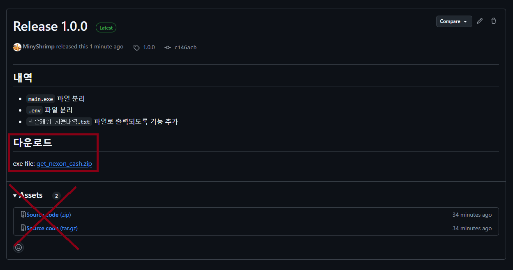
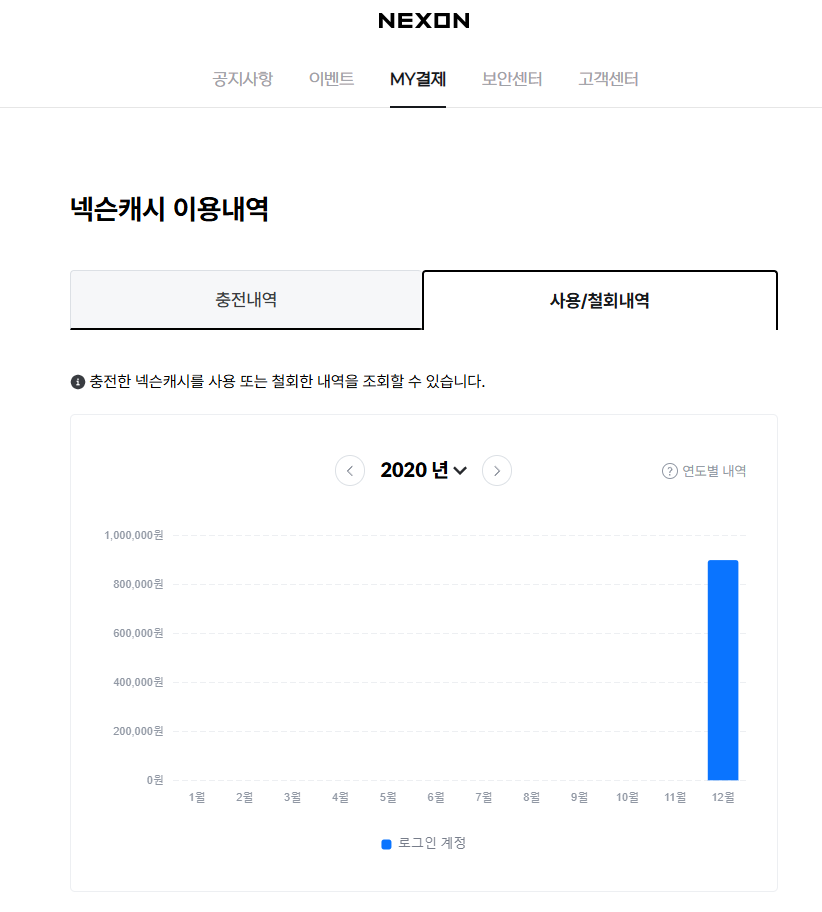
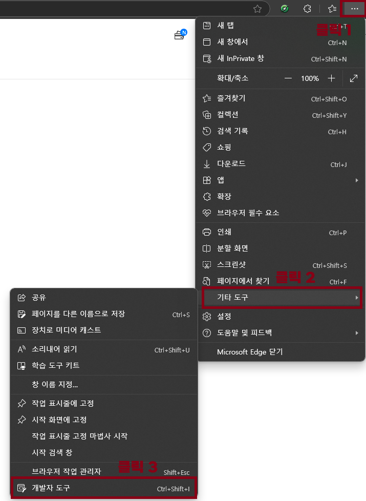
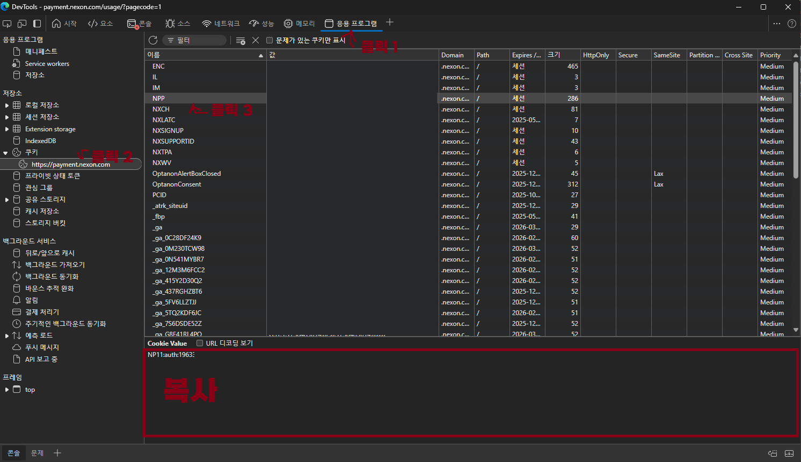

# 넥슨캐쉬 사용내역 확인

## 세팅

### Release 파일 다운로드


- https://github.com/MinyShrimp/GetNexonCash/releases/tag/1.0.0

### 넥슨 NPP 코드 얻기

- 넥슨 로그인
- https://payment.nexon.com/usage 접속



- 브라우저 관리자 툴 열기 (`F12` 혹은 `Ctrl+Shift+I`)



- 응용프로그램 -> 쿠키 -> `https://payment.nexon.com` -> `NPP`



- `NPP` 값 복사


### .env 파일 설정

- `.env` 파일 열기 (메모장)
- `your-npp-code`에 `NPP` 코드 입력

### main.exe 파일 실행

## 출력 예시 데이터

- 실제로는 숫자로 나옵니다
- `넥슨캐쉬_사용내역.txt` 파일이 같이 출력됩니다.

```
[넥슨]에서 사용한 총 금액: x,xxx,xxx
======================================================
[메이플스토리]에서 사용한 총 금액: x,xxx,xxx
------------------------------------------------------
  2020년: xxx,xxx
    12월: xxx,xxx
  2021년: x,xxx,xxx
    01월: x,xxx,xxx
    02월: xxx,xxx
    08월: xx,xxx
  2022년: x,xxx,xxx
    01월: xx,xxx
    07월: xx,xxx
    10월: xxx,xxx
    11월: x,xxx,xxx
    12월: xxx,xxx
  2023년: x,xxx,xxx
    09월: xx,xxx
    10월: xxx,xxx
    11월: xxx,xxx
    12월: xxx,xxx
  2024년: xxx,xxx
    01월: xxx,xxx
    09월: x,xxx
======================================================
[마비노기]에서 사용한 총 금액: x,xxx,xxx
------------------------------------------------------
  2024년: x,xxx,xxx
    06월: xxx,xxx
    07월: xxx,xxx
======================================================
[카트라이더: 드리프트]에서 사용한 총 금액: xx,xxx
------------------------------------------------------
  2024년: xx,xxx
    09월: xx,xxx
======================================================
```
